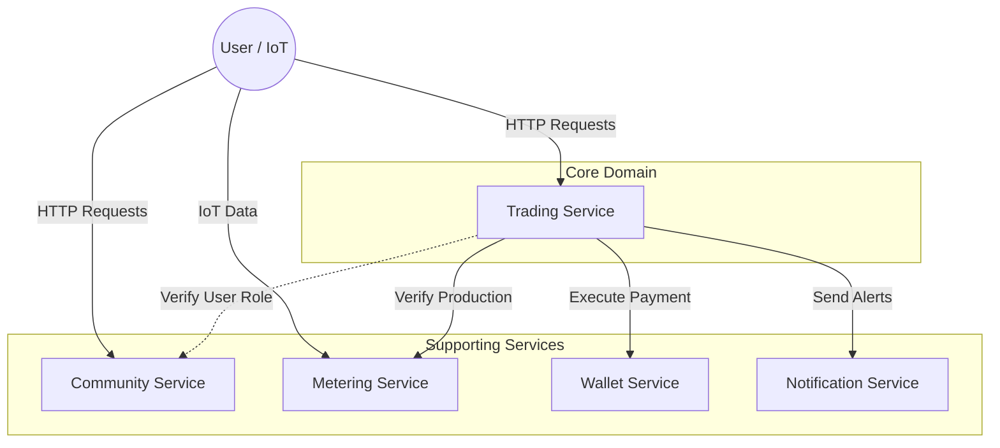

# EnerShare - System Architecture

EnerShare is a distributed platform designed for Peer-to-Peer (P2P) energy trading. The architecture embraces a hybrid approach: **Microservices** for scalability and isolation, **Domain-Driven Design (DDD)** for business logic organization, and **Hexagonal Architecture** (Ports & Adapters) for internal service structure.

## 1. High-Level Topology (Microservices)

The system is composed of 5 autonomous services, each responsible for a specific Bounded Context.



### Services Description
| Service | Pattern Role | Responsibility | Tech Stack |
| :--- | :--- | :--- | :--- |
| **Trading** | **Core Domain** | Managing Auctions, Bids, Offers, and the Matching Engine. | Java 17, Spring Boot, PostgreSQL |
| **Wallet** | Generic Subdomain | Managing virtual funds, Locking funds, Executing transfers. | Java 17, Spring Boot, PostgreSQL |
| **Metering** | Generic Subdomain | High-volume ingestion of Smart Meter data (IoT). | Java 17, Spring Boot, **MongoDB** |
| **Community** | Supporting Subdomain | User Identity (Households), Addresses, smart meter mapping. | Java 17, Spring Boot, PostgreSQL |
| **Notifications** | Generic Subdomain | Delivering async messages to users. | Java 17, Spring Boot |

---

## 2. Internal Structure (Hybrid Strategy)

The platform applies **Tactical Domain-Driven Design** by selecting the right architecture for each service's complexity:

### A. Core Domain: Hexagonal Architecture (Trading Service)
The `Trading` service contains the complex business rules (Matching Engine, Auction logic). We use **Hexagonal Architecture (Ports & Adapters)** here to strictly isolate the Domain from the Infrastructure.

**Layering:**
```text
src/main/java/com/enershare/trading/
├── api/                  <-- [Primary Adapter] REST Controllers
├── application/          <-- [Port] Input Ports (Use Cases like TradingEngineService)
├── domain/               <-- [Core] Entities (Bid, Offer) & Business Rules
└── infrastructure/       <-- [Secondary Adapter] Repositories & External Gateways
```

**Why?** This allows us to test the matching algorithm without a database and swap external providers (like the Wallet API) without touching the domain code.

### B. Supporting Subdomains: Layered Architecture (Community, Wallet, Metering)
Services like `Community` or `Metering` are primarily CRUD-oriented (Create/Read data). We use a simpler **Standard Layered Architecture** (Controller -> Service -> Repository) to avoid over-engineering.

---

## 3. Key Workflows

### A. The Trading Loop (Step-by-Step)
1.  **Offer/Bid Creation**: Users submit orders via REST API.
2.  **Session Closing**: The generic "Matching Engine" is triggered.
3.  **Matching Logic**: The system finds compatible Bids and Offers (Price/Quantity).
4.  **Energy Validation** *(Inter-service)*: Calls `Metering` to ensure the seller produced energy.
5.  **Fund Check & Lock** *(Inter-service)*: Calls `Wallet` to ensure the buyer has funds.
6.  **Transaction Execution**: 
    *   Records `Trade` in local DB (History).
    *   Calls `Wallet` to transfer money.
7.  **Notification**: Calls `Notification` to alert users.

---

## 4. Current Status & Roadmap

- [x] **Microservices Skeleton**: All services up and running in Docker.
- [x] **Trading Logic**: Matching engine functional with partial matches.
- [x] **Payments**: Wallet integration for real-time transfers.
- [x] **Gateways**: Infrastructure decoupled from Domain.
- [x] **Roles Management**: Enforcing "Prosumer" vs "Consumer" constraints.
